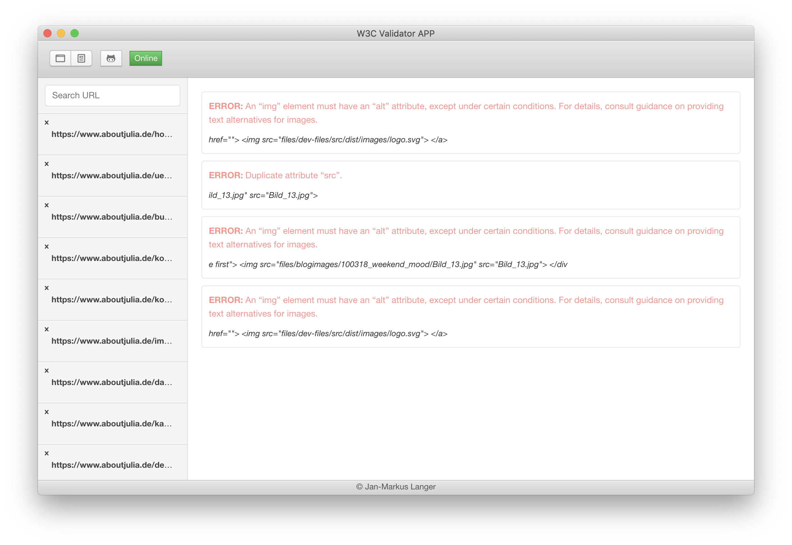

# W3C App

**A Desktop Application to validate your webpages with electron, photon and the w3c api**

Download it from the <a href="https://github.com/janmarkuslanger/w3c-app/releases">releases</a>

---

---

## Todos
-   [ ] Builder for Win / Linux
-   [ ] Storing pages
-   [ ] Structur app / remove messy code
