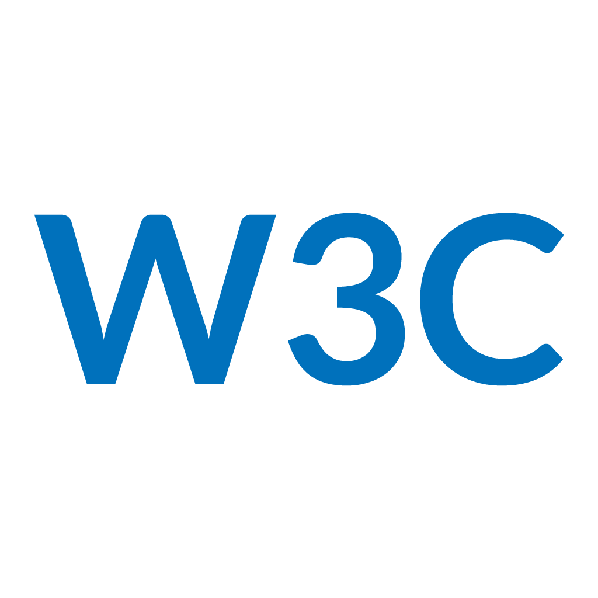

<strong>A Desktop Application to validate your webpages with electron, photon and the w3c api

---

---

## Releases
Download it from the <a href="https://github.com/janmarkuslanger/w3c-app/releases">releases</a>

## Todos
-   [ ] Builder for Win / Linux
-   [ ] Storing pages
-   [ ] Structure app / remove messy code

## Questions
For questions and support will free to create an issue or write an email to
janmarkuslanger10121994@gmail.com

## Issues
If you found a bug, then please create an issue. It will help a lot.

## Contribution
Pull requests are always welcome. I am always happy to see others working on
my GitHub projects.

## Get in touch
Write an email to janmarkuslanger10121994@gmail.com :)

